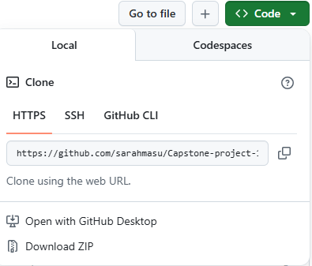

# Capstone Project 19 - Task Manager

A bootcamp project

### Table of Contents

1. [Introduction](#introduction)
2. [Project Description](#project-description)
3. [How to use the project](#project-use)

   3.1. [Registering Users](#reg_users)

   3.2. [Adding Tasks](#add_tasks)

   3.3. [Viewing Tasks](#view_tasks)

   3.4. [Statistics](#view_stats)

4. [Conclusion](#conclusion)
5. [References](#references)

## 1. Introduction 

This project was originally a bootcamp task that ran on the console. I wanted to create a GUI, using Tkinter, so I would not have to use the console. The objective of the task was to create a task manager program for a small business to help them manage the tasks of their employees.

## 2. Project Description 

The project, as stated in the introduction, is a task manager used to help a small business manage tasks of their employees. It allows the user to register new users, assign tasks to them, view tasks, update tasks, generate overviews, and see statistics.

Two files were given, user.txt and tasks.txt. The user.txt file contains the usernames and passwords of the users, one username and password per line. The format of the contents the usernames and password. The tasks.txt file contains a list of tasks assigned to their employees. Each task, in the tasks.txt file, consists of the following:

- The person assigned to the tasks (username).
- The title of the task.
- The description of the task.
- The date the task was given to the user.
- The date the task is due.
- The completion status of the task, 'Yes' - complete and 'No' - incomplete.

## 3. How to run the project?

To run the project you will need to clone the repo to your machine or download a zip file. You can find the either installation options from the dropdown list called code for the repo url or the option to download the zip at the top right corner, next to the _About_ section. Once you have cloned or unzipped the project, you will need to use an IDE, or an integrated development environment, such as Visual Studio Code (VS Code) to run the code. To ensure the program runs install the following:

- Tkinter
- Matplotlib
- tkcalendar
- numpy

    

## 4. How to use the project? 

When you run the program, it will first check if both the tasks.txt and user.txt exist. If the files exist, the program will read the user.txt file and import all the data into a dictionary, i.e., username: password. Once the list of usernames and passwords is stored in a dictionary. When the program has stored the list od usernames and passwords do the following:

- Step 1: Login by entering username and password (check the user.txt file).
- Step 2: Once logged in you will see a list of options, this will differ depending on the user. If the user is admin will see more options than other users. Look at the images below to see the difference.
- Step 3: Click on any of the five (for admin) or three buttons (for other users), they will allow to to register new users, create new tasks, view all tasks, tasks assigned to current user, or to view statistics. Clicking any of this buttons, with the exeception of Close, will generate widets on the right.
    * Register user: allows the admin to register new users. Enter the new user's username and password. You will need to confirm the password, then click Submit. The program will check if there username does not, and it checks if the password and confirm password is the same. If the username exists or if the passwords don't match, an error message will display. The Clear button clears the text boxes.
    * Add task: allows users to add new tasks. You are required to enter the title of the task, select the user, enter the description of the task, and select the due date of the task. Once done click Submit. Clear resets the selection (not working yet).
    * View all tasks: allows the user to view all tasks assigned to all registered users. The Generate report button, as the name states, generates two text files, task_overview.txt and user_overview.txt. Click this button to generate both files, they will be used for statitics function.
    * View my taks: will only display the tasks assigned to current logged in user. The user is able to update any tasks assigned to them by select the task number (do this twice, the first time it does not work). Once you have selected the task you want to update, the program fills in the rest of the widgets with the rest of the data, for example, if admin was to select a tasks assigned to them, it will fill in the assinged user, the title of the tasks, the description, the task status, and the due date. Admin could change the assigned user, the title of the task, description, task status, or the due date. When they are done manking these changes the admin clicks on the Update button to update the task and refreshes the list on the right to show the changes made by admin. If the user changes the assigned user that specific task no longer appears on the current user's list, click on View all tasks to see if it was assigned to the new user.
    * Statistics: diplays user and task overview reports. To display the report, click on View all tasks, then click on Generate report button to generate the text files. The textbox displays the information stored in the user_overview.txt and task_overview.txt files, such as the total number of tasks created, total number of incomplete and complete tasks, etc. The Plot graph button plots a bar chart that displays the number of complete and incomplete tasks by users.
- Step 4: When you have done, close the program.

    

    <em>Login window</em>

Once you have logged in, there are two menus, one for the admin and one for the other users. The windows share the following functions:

- Add tasks
- View all tasks
- View my tasks

There are two functions exclusive to the admin, which are:

- Statistics
- Register user

    
    

    <em>Main menu windows for admin (left) and other users (right).</em>

### 3.1. Registering new users 

This function is available only to admins. When you register a new user, you will be prompted to enter the new user's username and password. Once you confirm their password, the program will open the user.txt file and write the new user and password. Otherwise, it will loop until the admin ensures that the password and the confirmation password are the same. The same applies if the admin enters nothing when prompted to enter a password.

    

    <em>Register user window</em>

### 3.2. Adding a task 

When you choose to add a task, the program will open the tasks.txt file, then prompt the user to enter the title of the task, the task description, when the task is due, and who they wish to assign the task to. The date the task was added will be the current date, and the task will be defaulted to incomplete. All the information will be written to the file.

    

    <em>Add tasks window</em>

### 3.3. Viewing tasks 

There are two options when it comes to viewing tasks: view all assigned tasks and tasked assigned to tasks assigned to the current user.

#### View all tasks

    

    <em>View tasks window for all tasks.</em>

View All Task window displays, as the name states, all tasks.

#### View my tasks

   

   <em>View current user tasks window.</em>

View My Tasks displays tasks of the current user. On this window, the user can search for their task by selecting the task number using the combobox. Once they a task number has been chosen, the program retrieves the task and displays it on the text widget on the left and the right, and selects the user from the list in the combobox, inserts the task title, task description, and task completion status on the entry and text widgets, and selects that tasks due date on the calendar widget. If the user wishes to update the task, they can change:

- The task's assigned user uses the combobox.
- The task's title and completion status are available using the entry widget.
- The task's description, using a text widget.
- The task's due date by selecting a new date on the calendar widget.
  When the user is done updating the task, they just need to click on the 'Update' button to update to task. The task is updated, and the text widget refreshes to reflect the changes.

### 3.4. Statistics 

This function is available only to admins. The program reads and displays both task_overview and user_overview text files to a text box. The button plots a bar charts, the chart displays the number of incomplete an complete tasks assigned to each user.

    

    <em>Statistics window</em>

## 4. Conclusion

## 5. References 

- HyperionDev - Software Engineering Bootcamp: Level 1 Capstone Project 19
- [Adding captions to images](https://stackoverflow.com/questions/19331362/using-an-image-caption-in-markdown-jekyll)
